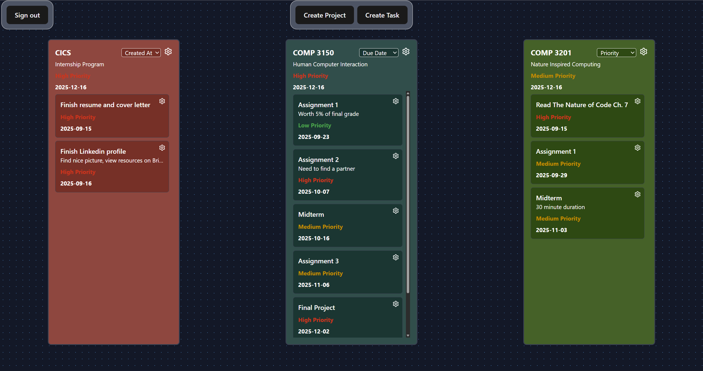
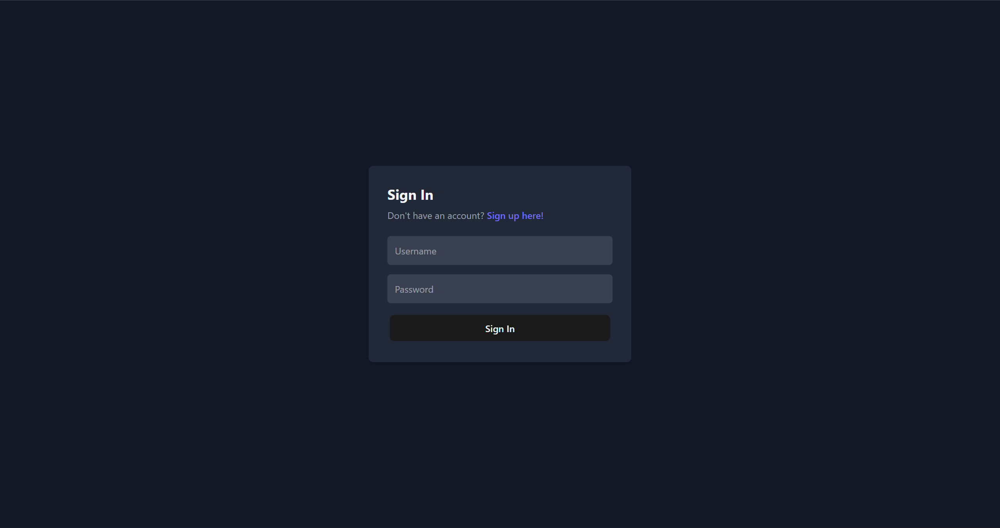

# Task & Project Manager

A modern task & project management web app built with **React** and **Supabase**.
Create projects, manage tasks, and stay on track with realtime updates, and sorting.

## Preview

## Features

- **Authentication**:

  - Users can store their projects and tasks in the cloud
  - Users can only view and modify their own projects and tasks

- **Projects**:

  - Create, edit, and delete projects
  - Custom colors for project cards
  - Priority and due dates support
  - Realtime sync with supabase

- **Tasks**:

  - Create, edit, and delete tasks
  - Priority and due dates support
  - Realtime sync with supabase

- **Sorting**:

  - Sort tasks by date created, priority, and due date

- **UI/UX**:
  - Responsive grid based layout for project cards
  - Scrollable task lists inside project cards.
  - Custom modals for creating, editing, and viewing projects and tasks
  - Light and dark mode support

## Tech Stack

- **Frontend**: React + Vite
- **Backend**: Supabase DB (Postgres + Auth + Realtime)
- **Styling**: TailwindCSS
- **Icons**: Lucide React
